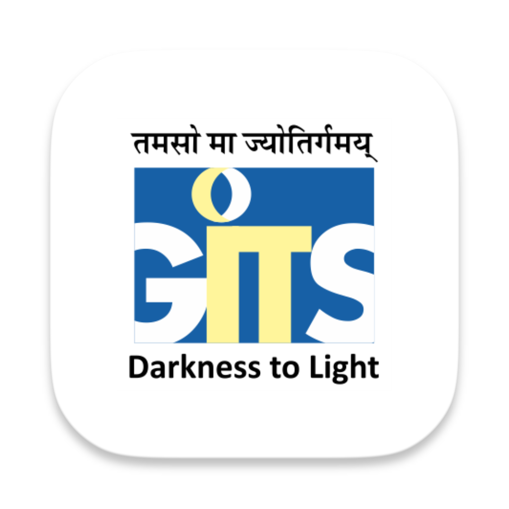

# GITS Udaipur Chatbot

  

## An interactive app developed using Flutter and Dialogflow CX

### Features

- **Course Information**: Get detailed information about various courses offered at GITS Udaipur.

- **Eligibility Criteria**: Understand the eligibility criteria for different programs.

- **Fee Structure**: Detailed fee structure for each course.

- **Real-time Responses**: Instant and accurate responses using Dialogflow CX.
